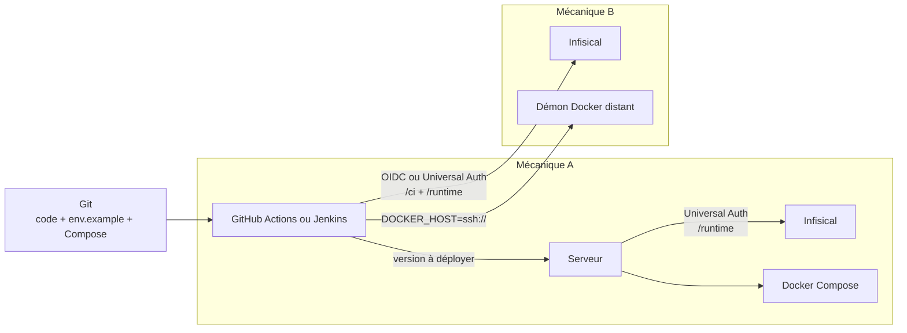

Infisical constitue la source de vérité des secrets de l’entreprise. Cette règle
s’applique aux nouvelles applications et à toute modification d’un pipeline
existant.

Git conserve le code, le contrat de configuration et les valeurs non sensibles.
Infisical conserve les mots de passe, jetons, clés privées, certificats et URL
qui contiennent des identifiants. Les développeurs et les pipelines récupèrent
ces valeurs avec leur propre identité.

:::danger[Règle d’entreprise]
Ne stockez aucun secret dans Git, Discord, une documentation, une image Docker
ou un fichier `.env` persistant sur un serveur. Une valeur transmise par l’un de
ces canaux doit être considérée comme compromise et faire l’objet d’une
rotation.
:::

## Classer les valeurs

| Valeur                          | Emplacement                    | Exemple                                   |
| ------------------------------- | ------------------------------ | ----------------------------------------- |
| Contrat de configuration        | Git, dans `env.example`        | noms des variables attendues              |
| Métadonnée calculée par le job  | Pipeline uniquement            | tag de l’image, chemin cible, domaine     |
| Secret d’exécution              | Infisical, chemin `/runtime`   | mot de passe de base, clé JWT, clé API    |
| Secret de build ou de transport | Infisical, chemin `/ci`        | jeton de registre, clé SSH de déploiement |
| Identifiant public Infisical    | Git ou variable CI             | Project ID, Project Slug, Identity ID     |
| Secret d’amorçage du serveur    | fichier protégé hors du projet | Client Secret Universal Auth              |

Une URL comme `DATABASE_URL` devient un secret dès qu’elle contient un nom
d’utilisateur ou un mot de passe.

Une métadonnée de déploiement ne va **jamais** dans Infisical. Le pipeline la
recalcule à chaque exécution : une valeur figée dans le coffre déploierait une
image périmée à la place de celle qui vient d’être construite.

:::caution[Point d’attention]
La configuration d’exécution non sensible — `POSTGRES_USER`, `SMTP_PORT`,
`FRONT_URL` — a sa place dans `/runtime`, aux côtés des secrets. La séparer dans
un second fichier oblige à maintenir deux sources par environnement, et une
`DATABASE_URL` désynchronisée de son `POSTGRES_USER` est la première cause de
déploiement cassé. Le critère est simple : si la valeur diffère d’une instance à
l’autre et que le pipeline ne sait pas la calculer, elle va dans `/runtime`.
:::

## Choisir le point d’injection

Deux topologies coexistent. La règle ci-dessus ne change pas ; le point où les
secrets entrent dans le déploiement, si.

| Critère                          | Mécanique A — stack hébergée | Mécanique B — CI pilote Docker  |
| -------------------------------- | ---------------------------- | ------------------------------- |
| Fichiers Compose                  | sur le serveur               | dans le dépôt, sur le runner    |
| Qui crée les conteneurs           | le serveur                   | le runner, par `DOCKER_HOST`    |
| Qui lit `/runtime`                | le serveur                   | le runner                       |
| Qui lit `/ci`                     | la CI                        | le runner                       |
| Amorçage sur le serveur           | fichier `.credentials`       | aucun                           |
| Le serveur héberge               | Compose, `.deploy.env`, données | les données seules           |

La mécanique A convient à une application déployée et redémarrée depuis le
serveur. La mécanique B convient à un pipeline qui construit une image, la
publie, puis pilote le démon Docker distant par SSH.

:::caution[Point d’attention]
Sur la mécanique B, refuser `/runtime` au runner ne protège rien : il contrôle
déjà le démon Docker de la machine, donc un `docker exec` sur le conteneur
applicatif révélerait les mêmes valeurs. La séparation `/ci` et `/runtime` y
reste utile pour d’autres raisons — accorder `/runtime` à un développeur sans
lui donner la clé SSH de déploiement, et distinguer les deux dans le journal
d’audit — mais elle ne constitue pas une frontière de sécurité.
:::



## Organiser un projet Infisical

Créez un projet Infisical par application déployable. Utilisez les mêmes noms de
clés dans tous les environnements, avec des valeurs propres à chacun.

```text
<application>
├── dev
│   ├── /ci
│   └── /runtime
├── staging
│   ├── /ci
│   └── /runtime
└── prod
    ├── /ci
    └── /runtime
```

- `/runtime` contient les valeurs consommées par les conteneurs ;
- `/ci` contient les valeurs nécessaires au build et au transport de la release.

Le plan Cloud gratuit d’Infisical inclut ces trois environnements. Toute autre
cible — une démonstration, une instance cliente — est un **préfixe de chemin**
dans l’un d’eux, jamais un quatrième environnement.

Nommez les secrets en majuscules avec des underscores : `DATABASE_PASSWORD`,
`JWT_SIGNING_KEY` ou `SMTP_PASSWORD`. Renseignez leur propriétaire, leurs
consommateurs et leur date de rotation dans les métadonnées Infisical.

### Héberger plusieurs instances clientes

Une application vendue à plusieurs organismes tourne sur autant d’instances, sur
autant de domaines. Ces instances sont des **dossiers**, pas des environnements.

Deux raisons. La liste des environnements est fixée par le plan Infisical, et le
plan Cloud gratuit en compte trois. Et même sans cette limite, un environnement
par client encombrerait chaque vue et chaque politique d’accès, alors qu’un
dossier se crée par script, porte sa propre politique, et se supprime proprement
quand un client s’en va.

```text
prod
├── /ci                      cible principale
├── /runtime
├── /common                  valeurs partagées par les clients
└── /clients
    ├── /organisme-un
    │   ├── /ci
    │   └── /runtime         importe /common
    └── /organisme-deux
        ├── /ci
        └── /runtime
```

Une instance de démonstration suit la même règle, dans l’environnement de
développement : `dev` avec le préfixe `/demo` donne `/demo/ci` et
`/demo/runtime`.

`/common` porte ce qui ne varie pas : port d’écoute, modèle du fournisseur d’IA,
serveur SMTP, réglages par défaut. Le dossier du client ne contient que ce qui
lui est propre : son domaine, ses mots de passe, ses clés. La CLI et l’action
GitHub résolvent les imports par défaut.

Ajouter un client se réduit alors à quatre gestes : créer
`/clients/<slug>/{ci,runtime}`, renseigner les valeurs propres, créer l’identité
`<application>-prod-<slug>`, lancer le job avec le préfixe de chemin
correspondant.

### Matrice d’accès

| Identité                        | Environnement | Chemins             | Droit                              |
| ------------------------------- | ------------- | ------------------- | ---------------------------------- |
| Développeur du projet           | `dev`         | `/runtime`          | lecture et écriture selon son rôle |
| `<application>-dev-vps`         | `dev`         | `/runtime`          | lecture                            |
| `<application>-github`          | `dev`         | `/ci` et `/runtime` | lecture                            |
| `<application>-jenkins-demo`    | `dev`         | `/demo`             | lecture                            |
| `<application>-prod-<slug>`     | `prod`        | `/clients/<slug>`   | lecture                            |

Créez une Machine Identity par application, environnement et consommateur. Une
identité de développement ne doit pas lire les secrets de production, et
l’identité d’un client ne doit pas lire ceux d’un autre.

Un développeur reçoit `/runtime` pour lancer la stack sur son poste, jamais
`/ci` : il n’a aucune raison de détenir la clé SSH de déploiement ni le jeton du
registre. C’est cette distinction qui justifie les deux chemins.

## Déclarer le contrat dans Git

Ajoutez un fichier `env.example` au dépôt. Il liste les paramètres requis sans
contenir de valeur réelle, et indique pour chacun d’où il vient :

```dotenv title="deployment/env.example"
# [pipeline] calculée par le job, jamais dans Infisical
APP_IMAGE_TAG=

# [/ci] secrets de transport
REGISTRY_TOKEN=
DEPLOY_SSH_PRIVATE_KEY=

# [/runtime] configuration d’exécution
DATABASE_URL=
JWT_SIGNING_KEY=
SMTP_PASSWORD=
```

Ajoutez une variable dans `env.example` et dans chaque environnement Infisical
concerné dans la même livraison. La revue de code contrôle le nom, le service
consommateur et le mode d’injection. La valeur ne figure ni dans la pull request
ni dans un ticket.

Le `.gitignore` doit couvrir tout ce que les outils locaux déposent, avec des
exceptions explicites pour les fichiers réellement suivis :

```text title=".gitignore"
.env
.env.*
.env-*
**/.env
**/.env.*
*.env
env.*
*.credentials
.infisical-token

!**/env.example
```

Sans les négations, un `git add -A` désindexerait les fichiers d’exemple.

Le fichier `.infisical.json` créé par `infisical init` contient l’identifiant du
projet et le domaine Infisical. Il ne contient aucun secret et peut rejoindre le
dépôt.

## Travailler en local

Chaque développeur utilise son compte Infisical. N’utilisez pas une Machine
Identity partagée sur les postes de travail.

```sh
infisical login
infisical init
infisical run --env=dev --path=/runtime -- npm run dev
```

`infisical run` transmet les valeurs au processus enfant sans créer de fichier
`.env`. La commande accepte plusieurs `--path`, mais **pas** de `--recursive` :
listez les chemins voulus explicitement.

```sh
infisical run --env=dev --path=/ci --path=/runtime -- ./deployment/deploy.sh
```

Une application qui exige un fichier `.env` doit évoluer vers la lecture de
variables. Pendant sa migration, générez le fichier pour la durée du test,
appliquez le mode `600`, gardez-le hors de Git et supprimez-le à la fin de la
session.

:::caution[Point d’attention]
N’exécutez pas `printenv`, `env`, `set -x` ou `docker compose config` sans
`--quiet` dans une session qui contient des secrets. Ces commandes peuvent les
copier dans les journaux du terminal ou du pipeline. Pour inspecter un Compose
sans fuite, utilisez `docker compose config --no-interpolate`.
:::

## Injecter les secrets dans Docker Compose

Docker Compose interpole `${VARIABLE}` depuis l’environnement du processus. Un
`infisical run` qui enveloppe la commande suffit donc : aucun `--env-file`,
aucun fichier écrit sur le disque.

```sh
infisical run --env=dev --path=/runtime -- \
  docker compose -f compose.yml up -d --wait
```

Déclarez les variables porteuses d’identifiants avec `:?`. Sans cela, Compose
n’échoue pas : il émet un avertissement et démarre un PostgreSQL sans mot de
passe.

```yaml title="compose.yml"
services:
  db:
    image: postgres:18-alpine
    environment:
      POSTGRES_USER: ${POSTGRES_USER:?Set POSTGRES_USER}
      POSTGRES_PASSWORD: ${POSTGRES_PASSWORD:?Set POSTGRES_PASSWORD}
      POSTGRES_DB: ${POSTGRES_DB:?Set POSTGRES_DB}
```

:::danger[Le `.env` fantôme]
Compose charge automatiquement un `.env` présent dans le répertoire du projet.
L’environnement du processus reste prioritaire, mais un fichier oublié
**fournirait** une variable absente d’Infisical et masquerait une erreur de
configuration. Faites échouer le script de déploiement s’il en trouve un :

```sh
[ ! -f .env ] || { echo "Un fichier .env traîne dans le dépôt." >&2; exit 1; }
```
:::

Une variable de conteneur apparaît dans `docker inspect` et peut atteindre les
journaux. Lorsque l’image prend en charge la convention `*_FILE`, préférez un
secret Compose monté dans `/run/secrets` :

```yaml title="compose.yml"
services:
  db:
    environment:
      POSTGRES_PASSWORD_FILE: /run/secrets/postgres_password
    secrets:
      - postgres_password

secrets:
  postgres_password:
    environment: POSTGRES_PASSWORD
```

### Secrets utilisés pendant le build

Un secret de build passe par un montage BuildKit. N’utilisez pas `ARG` ou `ENV`
pour un jeton de registre de paquets :

```dockerfile title="Dockerfile"
# syntax=docker/dockerfile:1
RUN --mount=type=secret,id=npm_token \
    NPM_TOKEN="$(cat /run/secrets/npm_token)" npm ci
```

L’identité CI lit `NPM_TOKEN` depuis `/ci`. BuildKit rend la valeur disponible
pendant l’instruction `RUN` concernée sans l’ajouter à l’image.

:::caution[Point d’attention]
Une variable compilée dans un bundle front — tout préfixe `VITE_`, `NEXT_PUBLIC_`
ou équivalent — est **publique par construction** : elle est lisible dans le
JavaScript livré à chaque visiteur. Elle reste dans Git, avec le code. Un secret
ne doit jamais porter ce préfixe.
:::

## Mécanique A — le serveur lit ses secrets

Un administrateur Infisical crée l’identité `<application>-dev-vps`, lui accorde
la lecture de l’environnement `dev` sous `/runtime`, puis active Universal Auth.
Le Client ID et le Client Secret permettent au serveur d’obtenir un jeton court.

Le serveur conserve ces deux valeurs dans un fichier distinct de la stack :

```dotenv title="/home/martin/.config/infisical/facturation-dev.credentials"
INFISICAL_UNIVERSAL_AUTH_CLIENT_ID='<client-id>'
INFISICAL_UNIVERSAL_AUTH_CLIENT_SECRET='<client-secret>'
```

Le répertoire utilise le mode `700` et le fichier le mode `600`. Le compte
`martin` en est propriétaire. Ne copiez pas ce fichier dans le répertoire de
l’application et ne le transmettez pas au pipeline.

La configuration non sensible reste avec le déploiement :

```dotenv title=".deploy.env"
APP_HOST=facturation.dev.step.eco
APP_IMAGE=studiofabrique/facturation
APP_IMAGE_TAG=1.4.2

INFISICAL_DOMAIN=https://app.infisical.com
INFISICAL_PROJECT_ID='<project-id>'
INFISICAL_ENVIRONMENT=dev
INFISICAL_CREDENTIALS_FILE=/home/martin/.config/infisical/facturation-dev.credentials
```

Le serveur déploie ensuite la stack sans créer de fichier de secrets :

```sh
deployment/with-infisical.sh docker compose \
  --env-file .deploy.env -f compose.yml config --quiet

deployment/with-infisical.sh docker compose \
  --env-file .deploy.env -f compose.yml up -d --wait --remove-orphans
```

## Mécanique B — le runner lit les secrets

Le runner récupère `/ci` et `/runtime`, puis pilote le démon Docker distant. Le
serveur n’héberge que ses données persistantes.

### Protéger les métadonnées du pipeline

Les valeurs injectées par Infisical entrent dans le même environnement que
celles calculées par le job. Un ancien fichier d’environnement importé en bloc
dans `/runtime` écraserait donc le tag de l’image.

Préfixez les métadonnées du pipeline, et redonnez-leur la priorité au début du
script de déploiement :

```sh title="deployment/deploy.sh"
# Les pipelines placent leurs métadonnées sous le préfixe `PIPELINE_` avant
# l’injection Infisical. Elles reprennent ici la priorité sur les variables de
# même nom.
for name in DEPLOY_MODE DEPLOY_PATH APP_IMAGE APP_IMAGE_TAG APP_HOST; do
    eval "is_set=\${PIPELINE_$name+x}"
    if [ "$is_set" = x ]; then
        eval "value=\${PIPELINE_$name}"
        export "$name=$value"
    fi
done
```

### Le wrapper Universal Auth

Ce script sert aux agents Jenkins et aux postes de développement. Il ne contient
aucune valeur sensible et peut rejoindre le dépôt :

```sh title="deployment/with-infisical.sh"
#!/bin/sh
set -eu

# Un `set -x` hérité du job afficherait le Client Secret et le jeton court.
set +x

# La CLI reconnaît les deux variables Universal Auth. Elles ne passent donc pas
# dans les arguments du processus, visibles avec `ps`.
INFISICAL_TOKEN="$(
    infisical login --method=universal-auth \
        --domain="$INFISICAL_DOMAIN" --plain --silent
)"
export INFISICAL_TOKEN
unset INFISICAL_UNIVERSAL_AUTH_CLIENT_ID INFISICAL_UNIVERSAL_AUTH_CLIENT_SECRET

exec infisical run \
    --domain="$INFISICAL_DOMAIN" \
    --projectId="$INFISICAL_PROJECT_ID" \
    --env="$INFISICAL_ENVIRONMENT" \
    --path="$INFISICAL_PATH_PREFIX/ci" \
    --path="$INFISICAL_PATH_PREFIX/runtime" \
    -- "$@"
```

`infisical login --method=universal-auth` lit
`INFISICAL_UNIVERSAL_AUTH_CLIENT_ID` et `INFISICAL_UNIVERSAL_AUTH_CLIENT_SECRET`
depuis l’environnement. Aucun identifiant ne figure donc sur la ligne de
commande.

`INFISICAL_PATH_PREFIX` vaut la chaîne vide pour la cible principale d’un
environnement, `/demo` pour la démonstration, `/clients/<slug>` pour une
instance cliente. Il commence par `/` et ne se termine jamais par `/`.

:::caution[Point d’attention]
Jenkins masque le Client Secret fourni par `withCredentials`, **pas** le jeton
court qui en dérive. D’où `--plain --silent`, et l’interdiction de `set -x` dans
les scripts de déploiement.
:::

## Utiliser Infisical dans GitHub Actions

GitHub Actions s’authentifie avec OIDC. Aucun secret d’amorçage n’est nécessaire :
GitHub signe lui-même le jeton d’identité, Infisical le valide auprès de
`https://token.actions.githubusercontent.com`. Tous les secrets du dépôt peuvent
donc disparaître, y compris la clé SSH de déploiement et le jeton du registre.

Configurez l’identité en OIDC Auth :

| Champ                | Valeur                                            |
| -------------------- | ------------------------------------------------- |
| Discovery URL        | `https://token.actions.githubusercontent.com`     |
| Issuer               | `https://token.actions.githubusercontent.com`     |
| Audience (`aud`)     | `https://github.com/StudioFabrique`               |
| Subject (`sub`)      | `repo:StudioFabrique/<depot>:environment:<env>`   |
| Access Token TTL     | 600 s                                             |

Le workflow accorde `id-token: write`, puis récupère les deux chemins :

```yaml title=".github/workflows/deploy.yml"
permissions:
  contents: read
  id-token: write

jobs:
  deploy:
    environment: development
    runs-on: ubuntu-latest
    steps:
      - uses: actions/checkout@v7

      - name: Charger les secrets de transport
        uses: Infisical/secrets-action@<sha-validé>
        with:
          method: oidc
          identity-id: ${{ vars.INFISICAL_IDENTITY_ID }}
          project-slug: ${{ vars.INFISICAL_PROJECT_SLUG }}
          env-slug: dev
          secret-path: /ci
          domain: https://app.infisical.com

      - name: Charger la configuration d’exécution
        uses: Infisical/secrets-action@<sha-validé>
        with:
          method: oidc
          identity-id: ${{ vars.INFISICAL_IDENTITY_ID }}
          project-slug: ${{ vars.INFISICAL_PROJECT_SLUG }}
          env-slug: dev
          secret-path: /runtime
          domain: https://app.infisical.com

      - name: Déployer
        run: ./deployment/deploy.sh
```

Épinglez l’action à un SHA de commit validé. L’Identity ID et le Project Slug ne
sont pas des secrets et peuvent rester dans des variables de dépôt.

L’action accepte `project-slug`, jamais `project-id`. `export-type` vaut `env`
par défaut : les valeurs deviennent des variables d’environnement pour les
étapes suivantes.

## Utiliser Infisical dans Jenkins

Le plugin Jenkins exige d’énumérer chaque clé une par une, sans joker ni import
d’un chemin entier. Sur une application qui compte une trentaine de variables,
cela reconstruit le problème que la migration cherche à supprimer : une liste à
maintenir en trois endroits.

Préférez la CLI sur l’agent. Le pipeline ne porte alors qu’un seul credential :

```groovy title="Jenkinsfile"
withCredentials([
    usernamePassword(
        credentialsId: 'INFISICAL_FACTURATION',
        usernameVariable: 'INFISICAL_UNIVERSAL_AUTH_CLIENT_ID',
        passwordVariable: 'INFISICAL_UNIVERSAL_AUTH_CLIENT_SECRET'
    )
]) {
    sh './deployment/with-infisical.sh ./deployment/deploy.sh'
}
```

Les valeurs non sensibles — Project ID, slug d’environnement, préfixe de chemin,
nom de la stack — deviennent des paramètres du job. Un job paramétré remplace
ainsi un job par client.

Ce choix suppose la CLI `infisical` installée sur les agents Jenkins. C’est le
seul coût de cette approche, à traiter avant le premier déploiement.

## Ajouter ou modifier un secret

1. le développeur ajoute le nom et un commentaire dans `env.example` ;
2. le propriétaire du secret crée la valeur dans les environnements concernés ;
3. un administrateur contrôle les droits des identités consommatrices ;
4. le pipeline vérifie `docker compose config --quiet`, déploie et attend les
   healthchecks ;
5. l’équipe retire l’ancienne valeur après validation si l’opération constitue
   une rotation.

Préférez deux credentials actifs pendant une rotation. Créez la nouvelle clé,
déployez-la, contrôlez le service, puis révoquez l’ancienne.

Générez les mots de passe sans caractère réservé, en base64url :

```sh
openssl rand -base64 32 | tr '+/' '-_' | tr -d '='
```

La valeur brute et la valeur utilisable dans une URL sont alors identiques, ce
qui supprime la principale source d’erreur des chaînes de connexion.

:::caution[Cas des bases de données]
Modifier `POSTGRES_PASSWORD` dans Infisical ne change pas le mot de passe d’une
base PostgreSQL existante. L’image officielle utilise cette variable lors de
l’initialisation du volume. Modifiez le rôle dans PostgreSQL, mettez à jour
Infisical — le mot de passe brut **et** l’URL qui le contient, dans la même
écriture — redéployez les consommateurs et contrôlez leurs connexions avant de
révoquer l’ancien accès.
:::

Un conteneur en cours d’exécution garde les valeurs reçues à son démarrage. Une
modification dans Infisical demande donc un redéploiement de la stack et la
validation de ses healthchecks. C’est aussi pourquoi une commande `docker
compose exec` voit l’ancien environnement, alors qu’un `docker compose run`
recrée un conteneur et reçoit le nouveau.

## Migrer une application existante

1. Inventoriez les fichiers `.env`, les credentials Jenkins, les GitHub Secrets
   et les messages qui contiennent une valeur sensible.
2. Créez le projet Infisical, ses environnements, les chemins `/runtime` et
   `/ci`, puis importez les valeurs connues.
3. Comparez les clés importées avec `env.example` et le Compose. Recréez les
   valeurs inconnues au lieu de les deviner.
4. Ajoutez les Machine Identities du serveur et des pipelines avec les droits de
   la matrice.
5. **Factorisez d’abord le déploiement, sans Infisical.** Extrayez la séquence
   dans un script versionné et faites-la valider par les pipelines existants,
   qui gardent leur ancienne source de secrets. Si un déploiement casse à cette
   étape, la cause est le script.
6. Basculez ensuite un environnement à la fois, en commençant par celui qu’on
   peut casser sans conséquence. Conservez l’ancien secret en place, inutilisé,
   pendant une semaine : le retour arrière est alors un `git revert`.
7. Faites tourner les valeurs exposées, puis retirez les anciens fichiers et
   credentials CI.

Ne supprimez la dernière copie d’un ancien secret qu’après le contrôle du
nouveau déploiement. Une valeur présente dans l’historique Git exige une
rotation même si un commit ultérieur la retire.

## Réagir à une fuite

1. révoquez ou faites tourner la valeur chez son fournisseur ;
2. remplacez-la dans Infisical et redéployez les consommateurs ;
3. consultez les journaux d’audit Infisical, CI et applicatifs ;
4. retirez la copie exposée afin d’éviter sa réutilisation ;
5. documentez la cause et ajoutez un contrôle qui empêche le même scénario.

Effacer un message ou un commit ne rétablit pas la confidentialité de la valeur.

Mesurez les effets fonctionnels avant d’agir : une clé de signature de session
déconnecte tous les utilisateurs, une clé d’activation invalide les invitations
déjà distribuées.

## Checklist de conformité

- [ ] Le dépôt contient un `env.example` sans valeur sensible, qui indique le
      chemin Infisical de chaque bloc.
- [ ] Infisical contient les mêmes clés dans chaque environnement requis.
- [ ] Les secrets applicatifs se trouvent sous `/runtime` et les secrets de
      transport sous `/ci`.
- [ ] Chaque environnement, client et consommateur possède sa Machine Identity.
- [ ] Les développeurs reçoivent `/runtime` sur `dev`, jamais `/ci`.
- [ ] GitHub Actions utilise OIDC, sans aucun secret de dépôt.
- [ ] Jenkins ne porte qu’un credential Universal Auth par instance.
- [ ] Aucune métadonnée de pipeline ne figure dans Infisical, et le script de
      déploiement leur redonne la priorité.
- [ ] Le script de déploiement refuse de démarrer si un `.env` traîne dans le
      dépôt.
- [ ] Les variables porteuses d’identifiants sont déclarées `${VAR:?}` dans le
      Compose.
- [ ] Les scripts n’affichent ni l’environnement ni la sortie complète de
      `docker compose config`.
- [ ] Une rotation possède un propriétaire, une date et une procédure de retour
      arrière.

## Références

- [Guide Infisical de Stéphane Robert](https://blog.stephane-robert.info/docs/securiser/secrets/infisical/)
- [Machine Identities Infisical](https://infisical.com/docs/documentation/platform/identities/machine-identities)
- [CLI `infisical run`](https://infisical.com/docs/cli/commands/run)
- [Intégration GitHub Actions](https://infisical.com/docs/integrations/cicd/githubactions)
- [Intégration Jenkins](https://infisical.com/docs/integrations/cicd/jenkins)
- [Secrets Docker Compose](https://docs.docker.com/compose/how-tos/use-secrets/)
- [Secrets de build Docker](https://docs.docker.com/build/building/secrets/)
