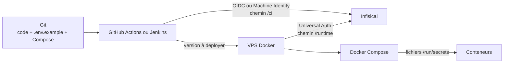

Infisical constitue la source de vérité des secrets de l’entreprise. Cette règle
s’applique aux nouvelles applications et à toute modification d’un pipeline
existant.

Git conserve le code, le contrat de configuration et les valeurs non sensibles.
Infisical conserve les mots de passe, jetons, clés privées, certificats et URL qui
contiennent des identifiants. Les développeurs et les pipelines récupèrent ces
valeurs avec leur propre identité.

:::danger[Règle d’entreprise]
Ne stockez aucun secret dans Git, Discord, une documentation, une image Docker ou
un fichier `.env` persistant sur un serveur. Une valeur transmise par l’un de ces
canaux doit être considérée comme compromise et faire l’objet d’une rotation.
:::



Le pipeline construit une image avec un tag immuable, la publie, puis demande au
VPS de déployer ce tag. Le VPS récupère les secrets d’exécution. GitHub Actions et
Jenkins n’accèdent pas au chemin `/runtime`.

## Classer les valeurs

| Valeur                          | Emplacement                    | Exemple                                   |
| ------------------------------- | ------------------------------ | ----------------------------------------- |
| Contrat de configuration        | Git, dans `.env.example`       | noms des variables attendues              |
| Configuration non sensible      | Git ou variable CI             | domaine, port, nom de base, tag d’image   |
| Secret d’exécution              | Infisical, chemin `/runtime`   | mot de passe de base, clé JWT, clé API    |
| Secret de build ou de transport | Infisical, chemin `/ci`        | jeton de registre, clé SSH de déploiement |
| Identifiant public Infisical    | Git ou variable CI             | Project ID, Project Slug, Identity ID     |
| Secret d’amorçage du VPS        | fichier protégé hors du projet | Client Secret Universal Auth              |

Une URL comme `DATABASE_URL` devient un secret dès qu’elle contient un nom
d’utilisateur ou un mot de passe. `APP_IMAGE_TAG`, `DEV_APP_HOST` et
`POSTGRES_DB` peuvent rester dans un fichier `.deploy.env` versionné ou généré
par le pipeline.

## Organiser un projet Infisical

Créez un projet Infisical par application déployable. Utilisez les mêmes noms de
clés dans les environnements `dev`, `staging` et `prod`, avec des valeurs propres
à chaque environnement.

```text
<application>
├── dev
│   ├── /runtime
│   └── /ci
├── staging
│   ├── /runtime
│   └── /ci
└── prod
    ├── /runtime
    └── /ci
```

- `/runtime` contient les valeurs consommées par les conteneurs ;
- `/ci` contient les valeurs nécessaires au build et au transport de la release.

Ajoutez un sous-dossier par service lorsque deux services demandent des droits
différents, par exemple `/runtime/web` et `/runtime/worker`. N’accordez pas un
accès récursif à la racine du projet pour contourner cette séparation.

Nommez les secrets en majuscules avec des underscores : `DATABASE_PASSWORD`,
`JWT_SIGNING_KEY` ou `SMTP_PASSWORD`. Renseignez leur propriétaire, leurs
consommateurs et leur date de rotation dans les métadonnées Infisical.

### Matrice d’accès

| Identité                 | Environnement       | Chemin     | Droit                              |
| ------------------------ | ------------------- | ---------- | ---------------------------------- |
| Développeur du projet    | `dev`               | `/runtime` | lecture et écriture selon son rôle |
| `<application>-dev-vps`  | `dev`               | `/runtime` | lecture                            |
| `<application>-prod-vps` | `prod`              | `/runtime` | lecture                            |
| `<application>-github`   | environnement ciblé | `/ci`      | lecture                            |
| `<application>-jenkins`  | environnement ciblé | `/ci`      | lecture                            |

Créez une Machine Identity par application, environnement et consommateur. Une
identité du VPS de développement ne doit pas lire les secrets de production.

## Déclarer le contrat dans Git

Ajoutez `.env.example` au dépôt. Le fichier liste les paramètres requis sans
contenir de valeur réelle :

```dotenv title=".env.example"
APP_ENV=
DATABASE_HOST=
DATABASE_NAME=
DATABASE_USER=
DATABASE_PASSWORD=
JWT_SIGNING_KEY=
SMTP_PASSWORD=
```

Ajoutez une variable dans `.env.example` et dans chaque environnement Infisical
concerné dans la même livraison. La revue de code contrôle le nom, le service
consommateur et le mode d’injection. La valeur ne figure ni dans la pull request
ni dans un ticket.

Le `.gitignore` doit couvrir les fichiers créés par les outils locaux :

```text title=".gitignore"
.env
.env.*
!.env.example
*.credentials
```

Le fichier `.infisical.json` créé par `infisical init` contient l’identifiant du
projet et le domaine Infisical. Il ne contient aucun secret et peut rejoindre le
dépôt.

## Travailler en local

Chaque développeur utilise son compte Infisical. N’utilisez pas une Machine
Identity partagée sur les postes de travail.

```sh
infisical login
infisical init
infisical run --env=dev --path=/runtime -- npm run dev
```

Remplacez `npm run dev` par la commande du projet. `infisical run` transmet les
valeurs au processus enfant sans créer de fichier `.env`.

Une application qui exige un fichier `.env` doit évoluer vers la lecture de
variables ou de fichiers `*_FILE`. Pendant sa migration, générez le fichier pour
la durée du test, appliquez le mode `600`, gardez-le hors de Git et supprimez-le
à la fin de la session.

:::Point d'attention
N’exécutez pas `printenv`, `env`, `set -x` ou `docker compose config` sans
`--quiet` dans une session qui contient des secrets. Ces commandes peuvent les
copier dans les journaux du terminal ou du pipeline.
:::

## Injecter les secrets avec Docker Compose

Le VPS lance la CLI Infisical sur l’hôte. La CLI injecte les valeurs dans le
processus Docker Compose, qui les monte dans les conteneurs sous
`/run/secrets/<nom>`. Le jeton Infisical n’entre pas dans les conteneurs.

Privilégiez la convention `*_FILE` dans l’application :

```yaml title="compose.dev.yml"
services:
  db:
    image: postgres:17
    environment:
      POSTGRES_DB: ${POSTGRES_DB:?Set POSTGRES_DB}
      POSTGRES_USER: ${POSTGRES_USER:?Set POSTGRES_USER}
      POSTGRES_PASSWORD_FILE: /run/secrets/postgres_password
    secrets:
      - postgres_password

  web:
    image: "${APP_IMAGE:?Set APP_IMAGE}:${APP_IMAGE_TAG:?Set APP_IMAGE_TAG}"
    environment:
      DATABASE_HOST: db
      DATABASE_NAME: ${POSTGRES_DB:?Set POSTGRES_DB}
      DATABASE_USER: ${POSTGRES_USER:?Set POSTGRES_USER}
      DATABASE_PASSWORD_FILE: /run/secrets/postgres_password
      JWT_SIGNING_KEY_FILE: /run/secrets/jwt_signing_key
    secrets:
      - postgres_password
      - jwt_signing_key

secrets:
  postgres_password:
    environment: POSTGRES_PASSWORD
  jwt_signing_key:
    environment: JWT_SIGNING_KEY
```

Compose ne donne un secret qu’aux services qui le déclarent. Le code lit le
chemin fourni par `DATABASE_PASSWORD_FILE` ou `JWT_SIGNING_KEY_FILE`.

Certaines applications acceptent encore le secret sous forme de variable. Le
bloc suivant sert de transition :

```yaml
environment:
  LEGACY_API_KEY: ${LEGACY_API_KEY:?Set LEGACY_API_KEY}
```

Une variable de conteneur apparaît dans `docker inspect` et peut atteindre les
journaux. Ajoutez la prise en charge de `LEGACY_API_KEY_FILE`, puis remplacez ce
bloc par un secret Compose.

### Secrets utilisés pendant le build

Un secret de build passe par un montage BuildKit. N’utilisez pas `ARG` ou `ENV`
pour un jeton de registre de paquets :

```dockerfile title="Dockerfile"
# syntax=docker/dockerfile:1
RUN --mount=type=secret,id=npm_token \
    NPM_TOKEN="$(cat /run/secrets/npm_token)" npm ci
```

```yaml title="compose.dev.yml"
services:
  web:
    build:
      context: .
      secrets:
        - npm_token

secrets:
  npm_token:
    environment: NPM_TOKEN
```

L’identité CI lit `NPM_TOKEN` depuis `/ci`. BuildKit rend la valeur disponible
pendant l’instruction `RUN` concernée sans l’ajouter à l’image.

## Configurer le VPS

Un administrateur Infisical crée l’identité `<application>-dev-vps`, lui accorde
la lecture de l’environnement `dev` sous `/runtime`, puis active Universal Auth.
Le Client ID et le Client Secret permettent au VPS d’obtenir un jeton court.

Le VPS conserve ces deux valeurs dans un fichier distinct de la stack :

```dotenv title="/home/martin/.config/infisical/facturation-dev.credentials"
INFISICAL_UNIVERSAL_AUTH_CLIENT_ID='<client-id>'
INFISICAL_UNIVERSAL_AUTH_CLIENT_SECRET='<client-secret>'
```

Le répertoire utilise le mode `700` et le fichier le mode `600`. Le compte
`martin` en est propriétaire. Ne copiez pas ce fichier dans le répertoire de
l’application et ne le transmettez pas au pipeline.

La configuration non sensible reste avec le déploiement :

```dotenv title=".deploy.env"
DEV_APP_HOST=facturation.dev.step.eco
APP_IMAGE=studiofabrique/facturation
APP_IMAGE_TAG=1.4.2
POSTGRES_DB=facturation
POSTGRES_USER=facturation

INFISICAL_DOMAIN=https://app.infisical.com
INFISICAL_PROJECT_ID='<project-id>'
INFISICAL_ENVIRONMENT=dev
INFISICAL_SECRET_PATH=/runtime
INFISICAL_CREDENTIALS_FILE=/home/martin/.config/infisical/facturation-dev.credentials
```

Adaptez `INFISICAL_DOMAIN` à l’instance EU ou auto-hébergée. Le script suivant
peut rejoindre le dépôt, car il ne contient aucune valeur sensible :

```sh title="deployment/with-infisical"
#!/bin/sh
set -eu
set +x

deploy_env_file="${DEPLOY_ENV_FILE:-.deploy.env}"

set -a
. "$deploy_env_file"
. "$INFISICAL_CREDENTIALS_FILE"
set +a

INFISICAL_TOKEN="$(
  infisical login \
    --method=universal-auth \
    --plain \
    --silent
)"
export INFISICAL_TOKEN

exec infisical run \
  --projectId="$INFISICAL_PROJECT_ID" \
  --env="$INFISICAL_ENVIRONMENT" \
  --path="$INFISICAL_SECRET_PATH" \
  -- "$@"
```

Le serveur déploie ensuite la stack sans créer de fichier de secrets :

```sh
deployment/with-infisical docker compose \
  --env-file .deploy.env -f compose.dev.yml config --quiet

deployment/with-infisical docker compose \
  --env-file .deploy.env -f compose.dev.yml pull

deployment/with-infisical docker compose \
  --env-file .deploy.env -f compose.dev.yml up -d --wait --remove-orphans
```

Le wrapper demande un nouveau jeton avant chaque commande. Infisical limite ce
jeton à la durée et aux droits configurés sur la Machine Identity.

## Utiliser Infisical dans GitHub Actions

GitHub Actions s’authentifie avec OIDC. L’identité Infisical borne le sujet au
dépôt et à la branche ou à l’environnement GitHub attendu. Une production peut
par exemple exiger le sujet suivant :

```text
repo:StudioFabrique/<depot>:environment:production
```

Le workflow accorde `id-token: write`, puis récupère le chemin `/ci` :

```yaml title=".github/workflows/deploy.yml"
permissions:
  contents: read
  id-token: write

jobs:
  deploy:
    environment: development
    runs-on: ubuntu-latest
    steps:
      - uses: actions/checkout@v4

      - name: Charger les secrets de déploiement
        uses: Infisical/secrets-action@<sha-validé>
        with:
          method: oidc
          identity-id: "<identity-id>"
          project-slug: "<project-slug>"
          env-slug: dev
          secret-path: /ci
          domain: "https://app.infisical.com"

      - name: Construire et déployer
        run: ./deployment/deploy-ci.sh
```

Épinglez les actions tierces à un SHA de commit validé dans le workflow réel.
L’Identity ID et le Project Slug peuvent rester dans Git. Ne donnez pas à cette
identité l’accès à `/runtime` : le script distant `deployment/with-infisical`
charge les secrets applicatifs sur le VPS.

## Utiliser Infisical dans Jenkins

Le plugin Jenkins Infisical prend en charge Universal Auth. Créez une identité
`<application>-jenkins` qui lit `/ci`, puis enregistrez son Client ID et son
Client Secret dans un credential Jenkins de type **Infisical Universal Auth
Credential**.

Le générateur de snippets Jenkins produit le bloc `withInfisical` adapté à la
version du plugin. Demandez les clés par leur nom au lieu d’importer le projet
entier :

```groovy title="Jenkinsfile"
withInfisical(
  configuration: [
    infisicalCredentialId: 'INFISICAL_FACTURATION_DEV',
    infisicalEnvironmentSlug: 'dev',
    infisicalProjectSlug: '<project-slug>',
    infisicalUrl: 'https://app.infisical.com'
  ],
  infisicalSecrets: [
    infisicalSecret(
      includeImports: false,
      path: '/ci',
      secretValues: [
        [infisicalKey: 'REGISTRY_USER'],
        [infisicalKey: 'REGISTRY_TOKEN'],
        [infisicalKey: 'VPS_SSH_PRIVATE_KEY']
      ]
    )
  ]
) {
  sh './deployment/deploy-ci.sh'
}
```

Le credential Infisical remplace les fichiers `APP_ENV` et les secrets
applicatifs copiés dans Jenkins. Le job déclenche le wrapper du VPS pour le
démarrage des conteneurs.

## Ajouter ou modifier un secret

Une pull request qui ajoute une dépendance à un secret suit cette séquence :

1. le développeur ajoute le nom et un commentaire dans `.env.example` ;
2. le propriétaire du secret crée la valeur dans les environnements concernés ;
3. un administrateur contrôle les droits des identités consommatrices ;
4. le pipeline vérifie `docker compose config --quiet`, déploie et attend les
   healthchecks ;
5. l’équipe retire l’ancienne valeur après validation si l’opération constitue
   une rotation.

Préférez deux credentials actifs pendant une rotation. Créez la nouvelle clé,
déployez-la, contrôlez le service, puis révoquez l’ancienne. Cette méthode évite
une coupure entre le fournisseur du secret et l’application.

:::Point d'attention[Cas des bases de données]
Modifier `POSTGRES_PASSWORD` dans Infisical ne change pas le mot de passe d’une
base PostgreSQL existante. L’image officielle utilise cette variable lors de
l’initialisation du volume. Modifiez le rôle dans PostgreSQL, mettez à jour
Infisical, redéployez les consommateurs et contrôlez leurs connexions avant de
révoquer l’ancien accès.
:::

Un conteneur en cours d’exécution garde les valeurs reçues à son démarrage. Une
modification dans Infisical demande donc un redéploiement de la stack et la
validation de ses healthchecks.

## Migrer une application existante

1. Inventoriez les fichiers `.env`, les credentials Jenkins, les GitHub Secrets
   et les messages qui contiennent une valeur sensible.
2. Créez le projet Infisical, ses environnements, les chemins `/runtime` et
   `/ci`, puis importez les valeurs connues.
3. Comparez les clés importées avec `.env.example` et le Compose. Recréez les
   valeurs inconnues au lieu de les deviner.
4. Ajoutez les Machine Identities du VPS et des pipelines avec les droits de la
   matrice.
5. Adaptez le Compose aux secrets montés et installez le wrapper
   `deployment/with-infisical`.
6. Déployez, contrôlez les healthchecks et testez les fonctions qui utilisent
   chaque fournisseur externe.
7. Révoquez les valeurs exposées sur Discord ou dans Git, puis retirez les
   anciens fichiers et credentials CI.

Ne supprimez la dernière copie d’un ancien secret qu’après le contrôle du
nouveau déploiement. Une valeur présente dans l’historique Git exige une
rotation même si un commit ultérieur la retire.

## Réagir à une fuite

1. révoquez ou faites tourner la valeur chez son fournisseur ;
2. remplacez-la dans Infisical et redéployez les consommateurs ;
3. consultez les journaux d’audit Infisical, CI et applicatifs ;
4. retirez la copie exposée afin d’éviter sa réutilisation ;
5. documentez la cause et ajoutez un contrôle qui empêche le même scénario.

Effacer un message ou un commit ne rétablit pas la confidentialité de la valeur.

## Checklist de conformité

- [ ] Le dépôt contient un `.env.example` sans valeur sensible.
- [ ] Infisical contient les mêmes clés dans chaque environnement requis.
- [ ] Les secrets applicatifs se trouvent sous `/runtime` et les secrets CI sous
      `/ci`.
- [ ] Chaque environnement et consommateur possède sa Machine Identity.
- [ ] Le VPS accède à `/runtime` en lecture avec Universal Auth.
- [ ] GitHub Actions utilise OIDC et Jenkins le credential Universal Auth du
      plugin Infisical.
- [ ] Le pipeline ne récupère pas les secrets applicatifs de `/runtime`.
- [ ] Docker Compose monte les secrets dans `/run/secrets` quand l’application
      accepte `*_FILE`.
- [ ] BuildKit monte les secrets utilisés pendant un build.
- [ ] Les scripts n’affichent ni l’environnement ni la sortie complète de
      `docker compose config`.
- [ ] Une rotation possède un propriétaire, une date et une procédure de retour
      arrière.

## Références

- [Guide Infisical de Stéphane Robert](https://blog.stephane-robert.info/docs/securiser/secrets/infisical/)
- [Machine Identities Infisical](https://infisical.com/docs/documentation/platform/identities/machine-identities)
- [CLI `infisical run`](https://infisical.com/docs/cli/commands/run)
- [Intégration GitHub Actions](https://infisical.com/docs/integrations/cicd/githubactions)
- [Intégration Jenkins](https://infisical.com/docs/integrations/cicd/jenkins)
- [Secrets Docker Compose](https://docs.docker.com/compose/how-tos/use-secrets/)
- [Secrets de build Docker](https://docs.docker.com/build/building/secrets/)
