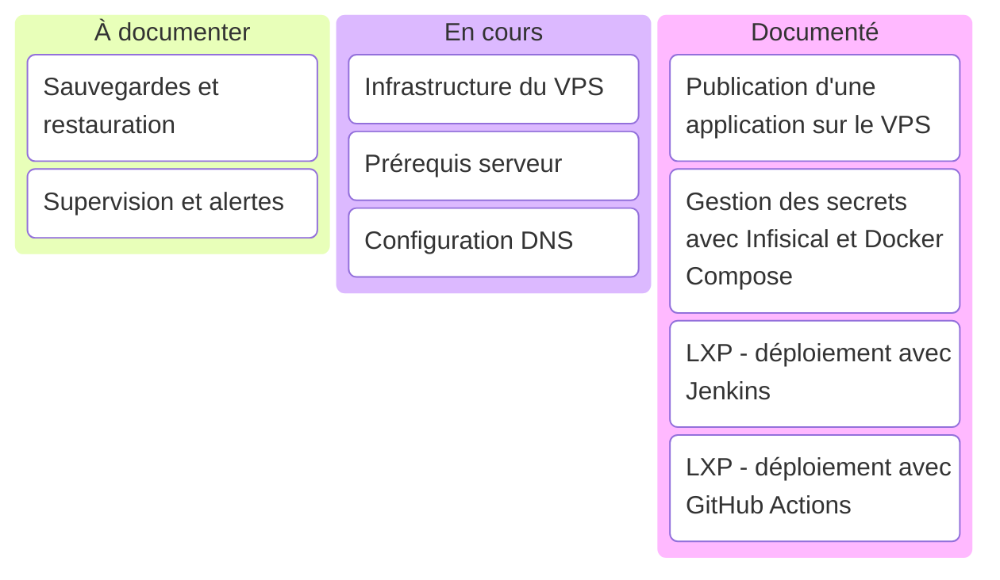

Ce tableau classe les sujets selon l’état de leur documentation. Une carte passe dans **Documenté** lorsque sa page fournit des instructions utilisables et passe le contrôle de compilation du site.

Mettez ce tableau à jour dans le même changement que la page concernée. Les cartes **En cours** correspondent à des pages présentes mais incomplètes. Les cartes **À documenter** n’ont pas encore de page dédiée.
